# 서울 창업 입지 추천 데이터베이스 ERD

작성일: 2026-09-03  
작성 주체: GPT(Codex)

이 문서는 업로드된 예시처럼 테이블·주요 컬럼·PK/FK 관계를 한눈에 확인하기 위한 ERD다. 실제 물리 스키마의 정본은 [`db/001_location_schema.sql`](../../db/001_location_schema.sql)이고, 아래 다이어그램은 팀 공유를 위해 핵심 컬럼을 압축해 표현한다.

이미지 파일: [PNG](data-schema-erd.png) · [SVG](data-schema-erd.svg)

## 전체 관계도

```mermaid
erDiagram
    META_DATASET_FILE ||--o{ LOCATION_AREA : source_file_id
    META_DATASET_FILE ||--o{ LOCATION_INDUSTRY : source_file_id
    META_DATASET_FILE ||--o{ LOCATION_AREA_CROSSWALK : source_file_id
    META_DATASET_FILE ||--o{ LOCATION_STORE_QUARTER : source_file_id
    META_DATASET_FILE ||--o{ LOCATION_SALES_QUARTER : source_file_id
    META_DATASET_FILE ||--o{ LOCATION_FLOW_QUARTER : source_file_id
    META_DATASET_FILE ||--o{ LOCATION_PERMITTED_ESTABLISHMENT : source_file_id
    META_DATASET_FILE ||--o{ LOCATION_PERMIT_QUARTER : source_file_id
    META_DATASET_FILE ||--o{ CONTEXT_METRIC_SNAPSHOT : source_file_id
    META_DATASET_FILE ||--o{ LOCATION_ANCHOR_POINT : source_file_id
    META_DATASET_FILE ||--o{ CONTEXT_PLAN_SNAPSHOT : source_file_id

    LOCATION_INDUSTRY ||--o{ LOCATION_STORE_QUARTER : industry_code
    LOCATION_INDUSTRY ||--o{ LOCATION_SALES_QUARTER : industry_code
    LOCATION_INDUSTRY ||--o{ LOCATION_PERMITTED_ESTABLISHMENT : industry_code
    LOCATION_INDUSTRY ||--o{ LOCATION_PERMIT_QUARTER : industry_code
    LOCATION_INDUSTRY ||--o{ CONTEXT_METRIC_SNAPSHOT : industry_code

    EVIDENCE_RECOMMENDATION_RUN ||--o{ EVIDENCE_CANDIDATE : run_id

    META_DATASET_FILE {
        bigint file_id PK
        string dataset_id
        string relative_path UK
        string source_name
        string source_type
        string sha256
        bigint row_count
        string observed_period_start
        string observed_period_end
        datetime retrieved_at
    }

    META_DATASET_RUN {
        uuid run_id PK
        string run_type
        string data_version
        string status
        datetime started_at
        datetime completed_at
    }

    LOCATION_AREA {
        string area_id PK
        string spatial_unit_type
        string spatial_unit_code
        string spatial_unit_name
        string sigungu_code
        string admin_dong_code
        geometry centroid
        geometry geom
        numeric area_m2
        bigint source_file_id FK
    }

    LOCATION_INDUSTRY {
        string industry_code PK
        string industry_name
        json food_terms
        json search_keywords
        json license_categories
        string boundary_note
        string ontology_version
        bigint source_file_id FK
    }

    LOCATION_AREA_CROSSWALK {
        bigint crosswalk_id PK
        string relation_type
        string source_area_id
        string target_area_id
        numeric overlap_m2
        numeric source_ratio
        numeric target_ratio
        boolean join_eligible
        boolean grain_is_proxy
        string method
        bigint source_file_id FK
    }

    LOCATION_STORE_QUARTER {
        string period PK
        string spatial_unit_type PK
        string spatial_unit_code PK
        string industry_code PK,FK
        integer total_store_count
        integer general_store_count
        integer franchise_store_count
        numeric open_rate
        numeric close_rate
        bigint source_file_id FK
        boolean is_partial_latest
    }

    LOCATION_SALES_QUARTER {
        string period PK
        string spatial_unit_type PK
        string spatial_unit_code PK
        string industry_code PK,FK
        numeric sales_amount
        numeric sales_count
        numeric weekday_sales_amount
        numeric weekend_sales_amount
        json detail_metrics
        bigint source_file_id FK
        boolean is_partial_latest
    }

    LOCATION_FLOW_QUARTER {
        string period PK
        string spatial_unit_type PK
        string spatial_unit_code PK
        numeric flow_total
        json detail_metrics
        bigint source_file_id FK
        boolean is_partial_latest
    }

    LOCATION_PERMITTED_ESTABLISHMENT {
        string permit_id PK
        string industry_code FK
        string business_type
        date licensed_at
        date closed_at
        string status
        string spatial_unit_code
        geometry point
        numeric x_5181
        numeric y_5181
        string source_type
        bigint source_file_id FK
        json source_attributes
    }

    LOCATION_PERMIT_QUARTER {
        string period PK
        string spatial_unit_type PK
        string spatial_unit_code PK
        string industry_code PK,FK
        integer operating_count
        integer new_count
        integer closed_count
        numeric open_rate
        numeric close_rate
        string quarter_status
        string source_type
        bigint source_file_id FK
    }

    CONTEXT_METRIC_SNAPSHOT {
        bigint metric_id PK
        string metric_name
        string period
        string period_type
        string spatial_unit_type
        string spatial_unit_code
        string industry_code FK
        numeric value_numeric
        string value_text
        string unit
        boolean grain_is_proxy
        string source_type
        bigint source_file_id FK
        datetime observed_at
    }

    LOCATION_ANCHOR_POINT {
        string anchor_id PK
        string anchor_type
        string place_name
        geometry point
        numeric x_wgs84
        numeric y_wgs84
        string sigungu_code
        string admin_dong_code
        string host_area_id
        string source_type
        bigint source_file_id FK
        datetime observed_at
        string coordinate_confidence
        boolean synthetic_anchor
    }

    CONTEXT_POI_SNAPSHOT {
        string source PK
        string poi_id PK
        datetime retrieved_at PK
        string place_name
        string category_group_code
        geometry point
        string road_address
        string place_url
        string search_mode
        string search_query
    }

    CONTEXT_PLAN_SNAPSHOT {
        bigint plan_id PK
        string plan_type
        string spatial_unit_type
        string spatial_unit_code
        string project_name
        string project_category
        string progress_stage
        numeric overlap_m2
        numeric overlap_ratio
        geometry plan_geom
        date observed_at
        string source_type
        bigint source_file_id FK
    }

    CONTEXT_NEWS_SNAPSHOT {
        string source PK
        string news_id PK
        date published_date
        string publisher
        string title
        string url
        string query_label
        json search_period
        string_array sigungu_tags
        string_array dong_tags
        datetime retrieved_at
    }

    EVIDENCE_RECOMMENDATION_RUN {
        uuid run_id PK
        string data_version
        json request
        json coverage_summary
        json run_manifest
        datetime generated_at
    }

    EVIDENCE_CANDIDATE {
        uuid run_id PK,FK
        string candidate_id PK
        string candidate_type
        string fit_tier
        string data_confidence
        json candidate_json
    }
```

## 관계 해석 규칙

- 실선 관계는 `db/001_location_schema.sql`에 선언된 실제 FK다.
- `period + spatial_unit_type + spatial_unit_code + industry_code`는 분기 업종 지표의 복합 PK다.
- `location.area_crosswalk.source_area_id/target_area_id`, `location.anchor_point.host_area_id`, `context.*.spatial_unit_code`는 공간 코드 기반의 논리 결합이며 현재 DB FK로 강제하지 않는다. 공간 단위와 crosswalk 규칙을 확인한 뒤 결합한다.
- `location.sales_quarter`는 상권·업종의 집계 매출이지 개별 신규 점포의 매출·손익 outcome이 아니다.
- `location.permitted_establishment`는 개별 인허가·개폐업 시점이지만 매출·비용·손익 데이터가 아니므로 성공 outcome으로 해석하지 않는다.
- `context.poi_snapshot`, `context.plan_snapshot`, `context.news_snapshot`는 맥락·근거 snapshot이다. 후보의 성공확률이나 미래 수익을 직접 저장하지 않는다.
- `evidence.candidate.candidate_json`은 추천 실행 결과의 설명용 JSON이며 학습 라벨 또는 성공확률 컬럼이 아니다.

## 저장소

- 로컬 원본: Postgres.app PostgreSQL 18.4, `127.0.0.1:5432/ideaton`
- 팀 공유 미러: Docker PostgreSQL 16.14, `<Docker 호스트 LAN/VPN IP>:55432/ideaton`
- Docker 확장: PostGIS 3.6.4, pgvector 0.8.2
- 접속·복원·방화벽 절차: [`docs/docker-postgres.md`](../docker-postgres.md)
