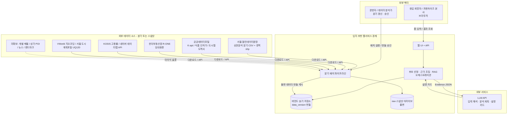
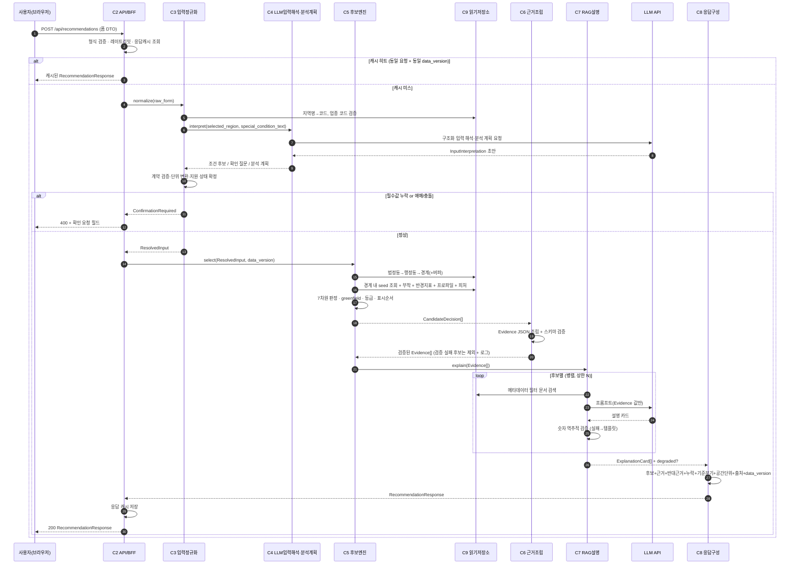
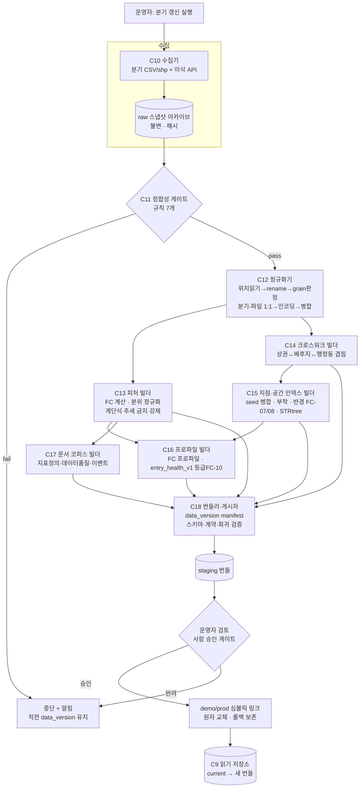
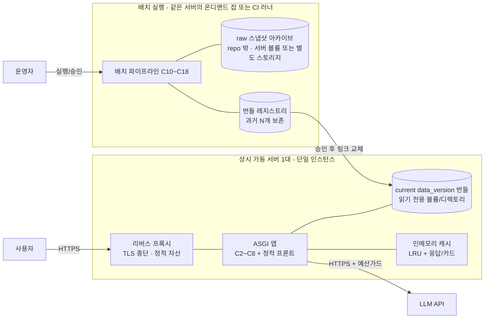

# 서울 창업 입지 추천 웹서비스 — 시스템 아키텍처

- 작성: 2026-09-02
- 작성 역할: system-architecture-designer
- 상태: 초안 (사람 승인 필요 — 배포 대상 서버·예산 확정(Q-2b), LLM 공급자 선정·약관 검토(Q-3b), `fit_index_v1` 가중치(Q-4b, 선택적 UX 정렬용))
- 확정: 후보/폴리곤 규모 = 저장소 실측값(Q-1) · 배포 형태 = 상시 가동 서버 1대(Q-2a) · 설명 생성 = 호스티드 LLM API, 로컬 모델 불채택(Q-3a) · `entry_health_v1`(FC-10) 산식·컷 = 승인 완료(Q-4a, 2026-09-02)
- 상위 계약(정본, 이 문서가 재정의하지 않음):
  - 입력: `artifacts/10-analysis/input-and-condition-contract.md`
  - 후보 선정: `artifacts/20-method/candidate-selection-spec.md`
  - 근거 스키마: `artifacts/20-method/rag-evidence-schema.json`
  - 지역 특성: `artifacts/10-analysis/regional-characteristics-profile.md`
  - 진입건전성 지표: `artifacts/20-method/entry-health-v1-cut-design.md` (FC-10 `entry_health_v1` 산식·등급 컷, 2026-09-02 승인)
  - 데이터 계약: `.claude/context/data-catalog-contract.md`, `.claude/context/metric-contract.md`, `.claude/context/rag-contract.md`
  - 데이터 정합성: `artifacts/10-analysis/data-integrity-check.md`
  - 통합 명세: `artifacts/final/recommendation-system-spec.md`
  - 설계 결정: `artifacts/adr/ADR-001-evidence-first-ranking.md`

이 문서는 **연구 단계 자산(`scripts/`, `output/`, `artifacts/`)을 웹서비스로 만들 때의 컴포넌트·데이터 흐름·저장소·배포·트레이드오프**를 정한다. 후보 선정 알고리즘, RAG 프롬프트, 특별조건 파싱 규칙, 등급 임계값은 위 계약 문서와 사람 승인 게이트에 위임하고 여기서는 **경계와 인터페이스**만 고정한다.

---

## 1. 목표와 범위

### 1.1 목표

1. 사용자가 웹 폼(서울특별시 / 자치구 / (선택)행정동 + 업종 1개 + 특별조건 텍스트)을 제출하면,
2. **선택 지역 안**의 조건 충족 후보 지점(아파트 단지·역 인근)을 `추천 / 조건부 검토 / 주의` 등급으로 3~5개 제시하고,
3. 각 후보에 **추천 근거 · 반대 근거 · 누락 데이터 · 기준 분기 · 공간 단위 · 출처**를 함께 반환한다.
4. 분기마다 서울시 상권 데이터와 이식 데이터를 재적재·재빌드해 조회용 저장소를 원자적으로 교체한다.

### 1.2 범위 (In scope)

- 동기 요청 경로: 폼 → API → 입력 정규화·계약 검증 → 후보 선정 엔진 → 근거 조립 → RAG 설명 → 응답 조립
- 배치 경로: 분기 CSV·이식 API 적재 → 정합성 게이트 → 정규화 → 피처/크로스워크/지점/프로파일/문서 빌드 → 버전드 번들 게시
- 저장소·런타임·컴포넌트 통신 선택과 버린 대안
- 배포 토폴로지, 환경 분리(dev/staging/demo), 관측성, 캐싱·레이트리밋·데이터 버전/재현성
- MVP → 확장 로드맵

### 1.3 명시적 비범위 (Out of scope)

| 항목 | 위임처 |
| --- | --- |
| 후보 공간 생성·하드필터·근거 차원 계산식·등급 규칙 | `candidate-selection-spec.md` |
| FC feature 정의 | `regional-characteristics-profile.md` §5·§7 |
| `entry_health_v1`(FC-10) 산식·가중치·등급 컷 | **확정** — `entry-health-v1-cut-design.md` (2026-09-02 승인) |
| `fit_index_v1` 가중치 (선택적 UX 정렬값) | 사람 승인 게이트 (Q-4b, 현재 응답에서 `fit_index=null`) |
| RAG 프롬프트 문구·설명 카드 카피·검색 랭킹 | `rag-contract.md`, rag-evidence-builder |
| 특별조건 텍스트 파싱 규칙 세부 | `input-and-condition-contract.md` |
| 학습형 Top-K 모델의 운영 재도입 | `ADR-001` (재검토 조건 충족 전 금지) |
| 개별 매물 수집·상세주소/호실/월세 생성 | 데이터 미확보 (catalog `missing`) |
| 인증·결제·사용자 계정·모바일 앱 | 데모 범위 밖 (실서비스 전환 시 P3) |
| 데이터 원천값의 정확성 보증 | 원천 제공기관 |

### 1.4 이 프로젝트에서 아키텍처가 강제하는 불변식

- 응답에 종합 점수를 **"성공 확률"로 부르는 필드를 두지 않는다.** 등급은 `추천 / 조건부 검토 / 주의`. `score_is_predictive=false`를 항상 동반한다.
- 후보 응답 계약에 추천 근거·반대 근거·누락 데이터·기준 분기·공간 단위·출처를 **모두** 포함한다 (`rag-evidence-schema.json` required).
- 계단식 갱신 데이터(상주인구·직장인구·K-apt 아파트·버스·도시철도 스냅샷)를 **분기 추세·모멘텀 피처로 만드는 파이프라인 단계를 두지 않는다.** 인구지표 변화율은 스코어링에서도 제외 (유동인구 FC-02만 추세 허용).
- **선택 지역(경계 + 최대 300m 버퍼) 밖 후보를 만드는 코드 경로가 없다.** 상권·상권배후지·행정동 동일 지표를 동시에 피처로 투입하지 않는다(한 지점당 가장 세밀한 grain 하나).
- 임대료·공실률은 **시장 권역/ R-ONE 상권 통계**이며 개별 매물 조건 저장소로 취급하지 않는다. 권역→후보 매핑 테이블을 경유하고 `grain_is_proxy=true`로 표기한다.
- 합성 데이터(향후 SNS 등)는 `source_type=synthetic` + 생성일·규칙을 표기한다.

---

## 2. 요구사항

### 2.1 기능 요구 (FR)

| ID | 요구 |
| --- | --- |
| FR-1 | 종속 드롭다운(시도 고정=서울특별시 → 자치구 → 행정동 선택)과 업종 셀렉트(CS100001~CS100010), 특별조건 자유 텍스트 입력을 제공한다. |
| FR-2 | 필수값(자치구, 업종) 누락 시 후보 생성을 시작하지 않고 누락 필드를 반환한다. |
| FR-3 | 특별조건 텍스트를 구조화 `conditions`로 변환하고, 애매/충돌/미지원 항목은 `confirmation_required` 또는 `unsupported_conditions`로 분리 반환한다. |
| FR-4 | 선택 지역 경계 내부 + 버퍼(≤300m)의 지점 seed(아파트 단지·역)를 후보로 만들고 80m 이내는 병합한다. seed 0개면 "지점 seed 없음" 사유를 반환한다. |
| FR-5 | 후보별로 7개 근거 차원(현재수요·경쟁시장수용·진입건전성·비용부담·수요구성·미래신호·데이터신뢰도)을 분리 계산하고 `추천/조건부 검토/주의`로 분류한다. |
| FR-6 | 대상 업종 점포 0 지점도 `greenfield=true`로 유지하며 자동 탈락시키지 않는다. |
| FR-7 | 후보 위치를 `시 > 구 > 동 > 앵커명 "인근" > 좌표 > 참조 상권(host)`으로 출력한다(`precision=지점`). 매물/역지오코딩 데이터가 없으면 `address_point=null`, 동·호수·출구번호·상가 호실을 생성하지 않는다. |
| FR-8 | 후보별 Evidence JSON(`rag-evidence-schema.json` 준수)을 조립하고, RAG가 그 값만으로 추천 근거·반대 근거·누락·최신성 설명 카드를 생성한다. |
| FR-9 | 응답에 `data_version`(기준 분기, 데이터셋별 관측 종료 시점, 파이프라인 git sha)을 포함한다. |
| FR-10 | 동일 등급 내 표시 순서는 `필수조건 충족 수 → 데이터 신뢰도 → 독립 긍정 근거 수 → 진입 건전성 → 반대 근거 심각도`로 결정한다. |
| FR-11 | 운영자가 분기 배치를 실행하고, 결과 번들을 staging에서 검토한 뒤 승인해야 demo/prod에 반영된다. |
| FR-12 | 후보가 부족하면 억지로 3~5개를 채우지 않고 "추천 없음 + 필요한 데이터"를 반환한다. |

### 2.2 비기능 요구 (NFR) — 수치 목표

| ID | 항목 | 목표 (데모/교내대회 규모) | 근거·비고 |
| --- | --- | --- | --- |
| NFR-1 | 동시 사용자 | < 10, 피크 유효 RPS < 1 | 과제 제시 규모. 시연·심사 접속 수준 |
| NFR-2 | 요청 지연 (엔진만, LLM 제외) | p95 < 1.5s | 저장소가 전부 사전계산 조회이므로 CPU 바운드 아님 |
| NFR-3 | 요청 지연 (설명 카드 포함) | p95 < 12s, 캐시 히트 < 300ms | LLM 호출 3~10s. 초과 시 후보 먼저 반환 + 설명 지연 로딩 |
| NFR-4 | 배치 전체 재빌드 | < 60분 | 점포 455MB·추정매출 826MB 파싱이 지배적 |
| NFR-5 | 데이터 신선도 | 분기 1회 갱신, 서울시 공개 지연 포함 최신 분기 대비 1~2분기 뒤 | 이식 데이터: 네이버 월, 버스·K-apt 주 스냅샷 — 분기 배치에 함께 스냅샷 |
| NFR-6 | 가용성 | 공식 SLA 없음(파일럿). 프로세스 자동 재시작 + `/readyz` 게이트. 배치 실패 시 직전 `data_version` 계속 서빙 | 상시 가동 서버지만 대회/파일럿 단계 — 짧은 다운타임 허용, 무중단 배포는 가용성 요구 생길 때 |
| NFR-7 | 재현성 | 임의 `data_version`을 고정 raw 스냅샷 + 파이프라인 git sha로 재빌드 가능 | 대회 심사·검증 대응 |
| NFR-8 | 설명 정직성 | RAG 설명 카드의 모든 수치가 Evidence JSON 값으로 역추적 가능 (자동 검증) | `rag-contract.md`. 실패 시 템플릿 폴백 |
| NFR-9 | 비용 상한 | LLM 호출 일일 예산 하드캡, 초과 시 템플릿 폴백 | `scripts/_budget.py` 패턴 재사용 |
| NFR-10 | 데이터 크기 | raw 약 1.4GB, 서빙 번들 목표 < 300MB (압축 parquet) | git-lfs 또는 오브젝트 스토리지 후보 |

### 2.3 규모 가정 (숫자로 명시 — 틀리면 무엇이 바뀌는가)

| 가정 | 값 | 틀렸을 때 바뀌는 것 |
| --- | --- | --- |
| A-1 동시 사용자 | < 10 | 100+ 이면: C9를 Postgres+PostGIS로, C2~C8 무상태 수평 확장, Redis 공유 캐시, 인기 `(자치구×업종)` 조합 사전계산 캐시. §9.2 |
| A-2 후보 seed 지점 총량 | 아파트 약 3,047 + 역 약 412 ≈ **3,500** (`data/공동주택/아파트단지_서울.csv` geocode 89.7%, `data/도시철도역사/역사정보_서울.csv` 412행) | 상가·근생 POI seed 확장 시 수만~수십만 → SeedSpatialBuilder 재설계, 인메모리 STRtree → mmap/PostGIS, 한 경계 내 후보 축소 규칙 강화 필요 |
| A-3 공간 폴리곤 | 상권 1,650 + 배후지 1,071 + 행정동 425 ≈ **3,150** (`data/영역/`) | **확정(2026-09-02, Q-1 답변)**: 저장소 실측값 기준. 과제 문구 "약 1.2만 개"는 채택하지 않음. STRtree·번들 크기·배치 PIP 시간은 이 값으로 산정 |
| A-4 피처 fact 행 수 | 업종 지표 상권 1,650 × 업종 10 × 분기 ~20 ≈ 330k + 지역 배경 상권/배후지/행정동 × 분기 × FC ~15 ≈ 1~2M → **총 2~3M 행** | 10배 이상이면 parquet 파티셔닝(분기별) + DuckDB 유지 가능. 100배면 컬럼 스토어/웨어하우스 |
| A-5 요청당 후보군 | 경계 내 seed 10~40개 → 표시 3~5개 | 한 자치구에 seed 수백 개(예: 강남구)면 축소 규칙(세대수·유동밀도 상위)이 품질을 좌우 → §8 리스크 |
| A-6 데이터 갱신 | 분기 1회, 운영자 수동 트리거 | 월/주 즉시 반영 요구 시 데이터셋별 독립 갱신 채널 + 증분 파이프라인 필요 |
| A-7 학습 없음 | 무거운 실시간 학습 없음. `entry_health_v1`은 공개 산식(4성분 서울 분위 동일가중)·동결 사분위 컷·서수 4등급, `fit_index_v1`은 선택적 정렬 보조값 | 학습모델 재도입은 `ADR-001` 재검토 조건(신규점포 outcome 확보) 충족 시 별도 설계 |
| A-8 서울 한정 | 서울특별시만 | 타 시도 확장 시 데이터 카탈로그·크로스워크·영역 shp 전면 재작성 |

### 2.4 가정 (데이터·계약)

- 서울시 상권분석 데이터는 분기 CSV로 계속 같은 스키마 계열로 배포된다(2세대 스키마 드리프트는 `data-integrity-check.md` H2~H4로 처리됨). 3세대 스키마가 나오면 정규화 사전 갱신 필요.
- 점포·추정매출은 연도 폴더가 분기를 중복 수록한다 → **분기-파일 1:1 배정**(H1)이 배치의 하드 규칙.
- 계단식 데이터(상주·직장인구)는 분기 코드가 있어도 값은 연 1~2회만 변한다 → 수준값만 사용.
- 기존 임대료 권역↔상권 매핑은 잔여이고, R-ONE 상권 72↔상권분석 상권은 **1차 명칭 proxy crosswalk 생성** → `join_eligible=yes`만 비용 차원에 연결하고 review·미해결은 보류한다.
- 개별 매물·POI·뉴스·랜드마크 단일시설·내국인 생활인구는 저장소에 없음 → 프로파일 `inactive` 슬롯 유지, 등급 상한 하향.
- LLM은 **호스티드 API 확정**(Q-3a, 2026-09-02). 로컬 모델은 불채택. 구체적 공급자 선정과 약관·데이터 반출 검토만 사람 승인 게이트에 남음(Q-3b).

---

## 3. 컨텍스트 다이어그램



- **시스템 경계 안**: 웹 UI·API, 후보/근거/RAG 오케스트레이션, 읽기 저장소, 배치 파이프라인, raw 스냅샷 아카이브.
- **경계 밖**: 모든 원천 데이터 제공기관, 지오코딩/검색 API, LLM API.
- 사용자는 원천 데이터·LLM과 직접 통신하지 않는다. 배치만 원천을 접촉하고, 요청 경로만 LLM을 접촉한다.

---

## 4. 컴포넌트 분해와 책임

### 4.1 서빙 플레인 (동기 요청 경로)

| ID | 컴포넌트 | 책임 | 입력 | 출력 | 상태 소유 | 재사용 자산 |
| --- | --- | --- | --- | --- | --- | --- |
| C1 | 웹 UI | 종속 드롭다운, 업종 셀렉트, 특별조건 입력, 등급별 결과·근거 카드·지도 렌더 | 사용자 상호작용 | HTTP 요청 | 없음(무상태) | `seoul_gu_dong_list.csv`, `dong_lists/` (자치구·행정동 목록) |
| C2 | API 게이트웨이 / BFF | 라우팅, 요청 검증(형식), 레이트리밋, 응답 캐시 조회, 관측성 태깅 | HTTP | 정규화된 호출 | 응답 캐시 키(파생) | 신규 |
| C3 | 입력 정규화·계약 검증기 | 지역명↔`data/영역/행정동` 코드 매핑, 업종 코드 검증, 종속 초기화 규칙, 평↔m² 변환, 요청 DTO 확정 | raw 폼 | `ResolvedInput` 또는 `ConfirmationRequired` | 없음 | `input-and-condition-contract.md`, `scripts/make_gu_dong_lists.py` |
| C4 | LLM 입력 해석·분석 계획기 | 자유 텍스트 → 업종·조건·분석 계획 초안. 읽기 전용 도구 호출과 확인 질문 생성. **최종 확정은 C3 계약 검증기** | `special_condition_text`, 선택 지역 | `InputInterpretation` 또는 `ConfirmationRequired` | 없음 | `input-and-condition-contract.md`, ADR-002 |
| C5 | 후보 선정 엔진 | (a) 지역 해석: 법정동→행정동→경계 (b) seed 조회·병합 (c) grain 부착 조회 (d) 지점 반경 FC-07·08 + 배경값 FC 조립 (e) 7차원 판정 (f) 등급·표시순서 | `ResolvedInput`, `data_version` | `CandidateDecision[]` | 없음(저장소 읽기 전용) | `scripts/sample_jamsil_coffee.py` (일반화 필요), `candidate-selection-spec.md` |
| C6 | 근거 조립기 | `CandidateDecision` → `LocationCandidateEvidence` JSON, 스키마 검증, `feature_build`·`source_freshness`·`evidence[]`·`grain_is_proxy` 채움 | `CandidateDecision[]` | 검증된 Evidence JSON[] | 없음 | `rag-evidence-schema.json` |
| C7 | RAG 설명 서비스 | 메타데이터 필터로 지표정의·데이터품질·이벤트 문서 검색 → LLM 프롬프트(Evidence 값만) → 설명 카드 → **숫자 역추적 검증기** → 실패 시 템플릿 폴백 | Evidence JSON | `ExplanationCard[]`, `degraded` 플래그 | RAG 카드 캐시(파생) | `rag-contract.md`, `scripts/_budget.py` |
| C8 | 응답 구성기 | 후보 + 추천/반대 근거 + 누락 + 기준 분기 + 공간 단위 + 출처 + `data_version` + 전역 주의문 조립. 후보 부족 시 "추천 없음" | Evidence JSON[], 카드[] | `RecommendationResponse` | 없음 | `final/recommendation-system-spec.md` 제품 흐름 |
| C9 | 읽기 저장소 (서빙) | 버전드 번들 제공: 지역 트리, seed·부착·반경지표, 피처 fact, 프로파일, 크로스워크, 문서 코퍼스, manifest | 조회 키 | 값 | **데이터 번들 소유**(불변, 배치가 생산) | `output/crosswalks/`, `output/entry_health/` |

### 4.2 배치 플레인 (분기 데이터 갱신 경로)

| ID | 컴포넌트 | 책임 | 입력 | 출력 | 상태 소유 | 재사용 자산 |
| --- | --- | --- | --- | --- | --- | --- |
| C10 | 수집기 | 서울시 분기 CSV·shp 다운로드, 이식 API 호출(K-apt·인허가·R-ONE·KOSIS·네이버·VWorld·UQ120), raw 스냅샷 아카이브에 불변 저장 | 원천 URL·API 키 | raw 스냅샷(타임스탬프·해시) | raw 아카이브 | `scripts/_raw.py`, `scripts/geocode.py`, `scripts/naver_datalab.py`, `scripts/ingest_*.py` (13개) |
| C11 | 정합성 게이트 | `data-integrity-check.md` 규칙 7개 검사: 분기-파일 중복키, 스키마 드리프트, grain 판정 충돌, 인코딩, 커버리지. **실패=중단·알림** | raw 스냅샷 | 정합성 리포트, pass/fail | 없음 | `scripts/audit_data_integrity.py`, `output/data_integrity_report.json` |
| C12 | 정규화기 | 위치 기반 읽기 → rename(ENG2KOR·건수블록·점포수 스키마) → grain 판정(경로+코드 소속) → 분기-파일 1:1 배정 → 인코딩 감지 → 병합. 커버리지 부족은 `null`+`missing_reason` | pass된 raw | 정규화 long 테이블 | 없음 | `scripts/audit_data_integrity.py` rename 사전 |
| C13 | 피처 빌더 | FC feature 계산(업종 지표 상권×업종, 지역 배경값), 시군구·서울 분위 정규화, `merge_key_dup_rate` 로그. **계단식 데이터 추세 피처 생성 금지 강제** | 정규화 테이블 | `fact_feature` parquet | 없음 | `regional-characteristics-profile.md` §5 |
| C14 | 크로스워크 빌더 | 상권↔배후지↔행정동 공간 겹침 크로스워크(중복 합산 방지, 결합용) | 영역 shp | `crosswalk_*` | 없음 | `scripts/build_overlap_crosswalks.py`, `output/crosswalks/` |
| C15 | 지점·공간 인덱스 빌더 | 아파트·역 seed 수집·지오코딩 캐시·80m 병합, 경계+버퍼 색인, seed→포함/최근접 상권·행정동·배후지 부착, seed 반경 250~500m FC-07·08 사전계산, STRtree 직렬화 | 영역 shp, seed 원천 | `seed_point`, `seed_attachment`, `seed_radius_metric`, `strtree.pkl` | 지오코딩 캐시 | `scripts/ingest_apartment_complex.py`, `scripts/ingest_subway_stations.py`, `scripts/sample_jamsil_coffee.py` seed 로직 |
| C16 | 프로파일 빌더 | 지점/상권/행정동별 FC 프로파일(active 11 / partial 13 / inactive 2), `entry_health_v1`(FC-10) = 4성분 분위(폐업률·개업률·점포증감률·라벨리스크) + risk 점수 + 4등급(양호/보통/주의/경계, scope별 동결 컷) + 산식·컷 메타, `profile_confidence` | `fact_feature`, seed 부착 | `profile` JSON | 없음 | `scripts/design_entry_health_cuts.py`, `output/entry_health/`, `entry-health-v1-cut-design.md` |
| C17 | 문서 코퍼스 빌더 | RAG 검색용 소규모 큐레이션 코퍼스: 지표 정의(metric-contract·프로파일), 데이터 품질 노트(integrity-check), 공식 이벤트(도시계획사업) — feature_id·grain·period 메타데이터 부착 | 계약 문서, 이벤트 데이터 | `doc_corpus` (md + 메타 인덱스) | 없음 | `.claude/context/*`, `data/도시계획사업/` |
| C18 | 번들러·게시자 | `data_version` manifest 생성, 스키마·계약 검증, 회귀 fault-cases 실행, staging 적재 → **사람 승인** → demo/prod 심볼릭 링크 원자 교체, 롤백 보존 | 위 모든 산출물 | 게시된 번들 | 번들 레지스트리 | `artifacts/evals/regression/fault-cases.md` |

### 4.3 횡단 관심사

| ID | 관심사 | 설계 |
| --- | --- | --- |
| X1 | 설정·시크릿 | 로컬·배치: `.env`(gitignore, 이미 존재) — VWORLD/NAVER/DATA_GO_KR 키. **서버**: 시크릿(LLM API 키 등)은 이미지·repo에 넣지 않고 서버 환경변수 또는 파일 주입(권한 600), 배포 도구의 시크릿 기능. 번들·로그에 시크릿 미포함. 앱 설정은 `data_version` 경로·LLM 모델·예산·캐시 TTL. 예산 확정 시 매니지드 시크릿으로 이전(Q-2b) |
| X2 | 캐싱 | (1) HTTP 응답 캐시: 키=`정규화 요청 + data_version`, TTL=다음 번들 교체까지 (2) 저장소 조회 인메모리 LRU (3) RAG 카드 캐시: 키=`candidate_id + evidence_hash + data_version`. 번들 교체 시 전부 무효화 |
| X3 | 레이트리밋·예산 가드 | IP당 토큰 버킷(예: 30 req/min) — 주목적은 LLM 예산 보호. LLM 일일 호출 하드캡(`scripts/_budget.py` 패턴), 초과 시 `degraded=true` + 템플릿 |
| X4 | 관측성 | 구조화 JSON 로그(request_id, resolved input, 후보 수, 등급 분포, greenfield 수, missing feature 수, 단계별 지연, LLM 토큰·비용, data_version). 메트릭: 요청율·단계별 지연 히스토그램·에러율·"추천 없음"율·LLM 예산 소진. 트레이스: 단일 프로세스 스팬 트리(응답 debug 블록에 단계 타이밍) |
| X5 | 데이터 버전·재현성 | `data_version = {기준_분기, build_ts, pipeline_git_sha, dataset_observed_end_periods{}, transplant_versions{}, raw_snapshot_hashes{}}`. 응답이 echo. 번들 불변. raw 스냅샷 읽기 전용 아카이브 → 임의 버전 재빌드 가능(NFR-7) |

### 4.4 논리 컴포넌트 ↔ 기존 하네스 역할 매핑

| 하네스 역할 (`.claude/agents/`) | 산출 계약 | 대응 런타임 컴포넌트 |
| --- | --- | --- |
| location-input-contract-builder | `input-and-condition-contract.md` | C3 입력 정규화기 + C4 LLM 입력 해석·분석 계획기 |
| location-data-auditor | `data-inventory.md`, `data-integrity-check.md`, `data-usage-classification.md` | C11 정합성 게이트 + C12 정규화기 (규칙의 런타임 구현) |
| candidate-method-designer | `candidate-selection-spec.md` | C5 후보 선정 엔진 + C15/C16 빌더 (사전계산 부분) |
| rag-evidence-builder | `rag-evidence-schema.json` | C6 근거 조립기 + C17 문서 코퍼스 빌더 |
| recommendation-qa-reviewer | `recommendation-quality-review.md`, `fault-cases.md` | C18 번들러의 회귀 검증 + CI 게이트(§8.3) |
| seoul-site-recommendation-orchestrator | `final/recommendation-system-spec.md` | C8 응답 구성기 + 배치 오케스트레이션 |

즉 **하네스는 "설계 시점" 오케스트레이터, 이 아키텍처는 "런타임" 구현**이다. 계약 문서가 바뀌면 대응 컴포넌트를 재빌드/재배포한다.

---

## 5. 데이터 흐름

### 5.1 동기 요청 시퀀스



**지연 예산 배분(목표)**: 선택값 정규화 < 200ms · LLM 입력 해석 < 2s(캐시 미스 기준) · 엔진 조회+판정 < 1.3s · 근거 조립 < 100ms · 설명 생성(후보 5개 병렬) 3~10s · 응답 조립 < 50ms. 입력 해석이 실패하면 확인 질문을 반환하고, 설명 생성이 예산을 넘기면 후보+등급+근거를 먼저 반환한 뒤 설명 카드를 지연 로딩한다.

**LLM 장애/예산 초과**: 입력 해석 단계에서는 결정론적 최소 파서 또는 확인 요청으로 폴백하고 임의 조건을 확정하지 않는다. 설명 단계에서는 C7이 템플릿 설명(Evidence 값을 문장 템플릿에 대입)으로 폴백하고 응답에 `explanation_mode="template"`, `degraded=true`를 표기한다. 후보·등급·근거 차원은 LLM과 무관하게 검증된 입력에 대해서만 제공된다(ADR-001·ADR-002).

### 5.2 배치 데이터 파이프라인



**배치 단계별 하드 규칙(불변식 반영)**:

1. C11이 `merge_key_dup_rate ≠ 0`, grain 판정 충돌 ≠ 0이면 **번들 생산 자체를 중단**한다(H1·H4).
2. C13은 상주인구·직장인구·K-apt·버스·도시철도 스냅샷 데이터로 `*_증감률`, `*_모멘텀`, `*_추세` 컬럼을 만들지 않는다. 이 데이터는 "최신 유효 스냅샷 수준"만 산출한다. (유동인구 FC-02, 추정매출 추세, 폐업률 추세, 외국인 생활인구 FC-06은 진짜 분기 시계열이므로 허용.)
3. C15는 seed→상권 부착 시 포함(PIP) 우선, 없으면 최근접(≤300m), 초과면 상권 미부착(행정동 배경값). 상권·배후지·행정동 동일 FC를 **동시에 채우지 않는다**(가장 세밀한 grain 하나 + `grain_is_proxy` 표기).
4. C16의 `entry_health_v1`(FC-10)은 **승인된 산식**(`risk = 0.25·폐업률분위 + 0.25·(100−개업률분위) + 0.25·(100−점포증감률분위) + 0.25·라벨리스크`, 전 업종 통합 지역 배경, 업종 구분 없음)과 **20261 서울 사분위 동결 컷**(상권 `[41,51,62]`·행정동 `[42,52,61]`)으로 4등급을 산출한다. 컷은 분기마다 재계산하지 않는다(재동결 시 `v2`). C5는 이 등급을 **`주의`·`경계`일 때 반대 근거 목록의 한 항목**으로 쓰고, 동일 `fit_tier` 내 표시 순서 tiebreaker(FR-10 4순위)로만 참조한다 — `fit_tier` 자체를 올리는 게이트로는 쓰지 않는다. 응답에는 등급 + 입력 분위 4개 + 산식 + 컷 + `score_is_predictive=false`를 항상 함께 싣는다. 라벨/성분 결측은 재정규화 규칙(`entry-health-v1-cut-design.md` §1)을 따르고, 어느 상권·행정동에도 안 붙는 지점은 `정보없음`.
5. C12는 임대료를 별도 로더로 언피벗(권역 grain), 권역→후보 매핑 테이블 경유. `투자수익률/소득수익률/자본수익률` 컬럼 미로드.
6. C18은 게시 전 `rag-evidence-schema.json`으로 샘플 Evidence를 검증하고 `fault-cases.md` 회귀를 실행한다. 하나라도 실패하면 staging까지만.

**갱신 주기 처리**: 분기 배치가 모든 데이터셋의 스냅샷을 함께 찍는다. 네이버 트렌드(월)·버스·K-apt(주)는 배치 시점 최신 스냅샷을 사용하고 `source_freshness.update_cadence`에 `monthly`/`snapshot`을 기록한다. 진행 중 부분 기간(외국인 20263, 인허가 20263, 네이버 진행월)은 `is_partial_latest=true`.

---

## 6. 데이터 모델·저장소 선택

### 6.1 논리 데이터 모델 (서빙 번들 내부)

> 스키마 정본은 계약 문서. 아래는 저장소 배치를 위한 **논리 형태**이며 상세 컬럼은 C13/C15/C16 구현에 위임.

| 엔티티 | 키 | 핵심 필드 | grain | 생산자 |
| --- | --- | --- | --- | --- |
| `dim_region` | `admin_dong_code` | 시도·자치구·행정동명, 법정동↔행정동 매핑, centroid | 행정동 | C12 |
| `dim_space` | `space_code` | grain(상권/배후지/행정동), 명칭, 자치구코드, 행정동코드, x/y(5181), `영역_면적`, polygon_wkb | 상권/배후지/행정동 | C12·C14 |
| `fact_feature` | `(period_code, grain, space_code, industry_code?, feature_id)` | value, unit, `sigungu_pctl`, `seoul_pctl`, `missing_reason`, `source_path`, `quarter_file_source`, `normalization[]` | 상권·배후지·행정동 (× 업종?) | C13 |
| `seed_point` | `seed_id` (`APT-{kaptCode}` / `STN-{역번호}`) | type, name, x/y(5181), households/line, `geocode_신뢰도`, source_path | 지점 | C15 |
| `seed_attachment` | `seed_id` | `host_area_code`, relation(포함/최근접), distance_m, admin_dong_code, hinterland_code[], overlapping_units | 지점→배경 grain | C15 |
| `seed_radius_metric` | `(seed_id, feature_id, radius_m)` | value(역 수·환승·정류소 수·세대수 합·최근접 거리), as_of, `nearby_anchors[]` | 지점 반경 | C15 |
| `profile` | `(as_of_quarter, grain, space_code \| seed_id)` | FC feature 객체(status·value·분위·limitation), `entry_health_v1`{grade, risk, inputs[4], formula, cuts, version}, `profile_confidence` | 지점/상권/행정동 | C16 |
| `crosswalk_*` | `(from_code, to_code)` | 겹침 비율, 공간 관계 | 상권↔배후지↔행정동 | C14 |
| `region_cost_map` | `space_code` | 권역 코드, R-ONE 상권 코드(있으면), 매핑 신뢰도 | 상권→권역 또는 `join_eligible` R-ONE proxy crosswalk | C12 |
| `doc_corpus` | `doc_id` | 본문(md), `feature_id[]`, `grain`, `period`, `doc_type`(정의/품질/이벤트), `source_path` | 문서 | C17 |
| `manifest` | `data_version` | 기준 분기, build_ts, git_sha, dataset 관측 종료·주기, raw 해시 | 번들 | C18 |

**중복 합산 방지**: `fact_feature`는 grain별로 분리 저장하되 C5는 한 지점당 한 grain만 읽는다(`seed_attachment`가 어느 grain을 쓸지 결정). `crosswalk_*`는 결합·설명용이지 값 합산용이 아니다.

### 6.2 저장소 선택

#### 결정 D-3: 피처·프로파일 저장소 = 버전드 Parquet + DuckDB (조회는 인프로세스)

| | 선택 | 대안 A | 대안 B |
| --- | --- | --- | --- |
| 방식 | 분기별 파티션 Parquet 파일 + DuckDB(인프로세스 SQL) + 프로파일/seed는 JSON·경량 SQLite | 단일 SQLite 파일(버전당 1개) | PostgreSQL + PostGIS |
| 장점 | 배치가 pandas이므로 Parquet가 자연 산출물 · 컬럼 압축(번들 < 300MB) · 분위 재계산 등 group-by 빠름 · **번들 = 불변 디렉토리 = data_version 그 자체**(재현성) · 서버 프로세스 0 | 단일 파일 원자 교체 · 제약·인덱스 강제 · 트랜잭션 | 진짜 공간 인덱스(GiST) · 동시성 · 표준 SQL · 확장 용이 |
| 단점 | 스키마·제약 미강제(계약 테스트로 보완) · 공간연산은 별도(§6.3) | 대용량 스캔·분위 계산이 상대적으로 느림 · 컬럼 압축 없음 | 운영 부담(서버·백업) · **data_version 스냅샷이 번거로움**(스키마-per-version 또는 덤프) · 데모 규모에 과함 |
| 이유 | NFR-1(동시성 낮음)·NFR-7(재현성)·A-4(수백만 행) 조합에서 "불변 파일 번들"이 가장 단순하고 정직. 조회는 키 기반 lookup이라 RDB 동시성이 불필요 | — | — |
| 되돌리는 비용 | **중**. C9 조회 API가 저장소를 추상화하므로 어댑터 교체로 SQLite/PostGIS 전환 가능. 배치 산출 포맷 변경 필요 |

동시 사용자가 100+로 커지면(A-1 붕괴) 대안 B(PostGIS)로 전환한다. C9의 조회 인터페이스(§7.2)를 지금 고정해 두면 전환이 어댑터 교체로 끝난다.

#### 결정 D-4: 공간 연산 = 배치에서 전부 사전계산 + 인메모리 STRtree

| | 선택 | 대안 |
| --- | --- | --- |
| 방식 | C15가 배치 시 seed→폴리곤 PIP·최근접·반경 집계를 전부 계산해 `seed_attachment`·`seed_radius_metric`에 저장. 런타임은 지오메트리 연산 없음. 지도 표시·`nearby_anchors` 즉석 조회용으로 STRtree(shapely) 직렬화본을 앱 기동 시 로드 | 런타임 PostGIS로 요청 시 `ST_Contains`·`ST_DWithin` 실행 |
| 이유 | seed 약 3,500 · 폴리곤 약 3,150은 배치에서 수 분이면 전부 계산 가능. 런타임을 순수 조회로 만들면 NFR-2(p95 < 1.5s)가 쉽게 달성되고 결과가 결정적·캐시 친화적 | 실시간 임의 좌표(매물) 입력이 생기면 유리하지만 현재 없음 |
| 라이브러리 | 이미 설치됨: `shapely 2.1`, `pyproj 3.7`(좌표계 5174/5186/4326→5181), `numpy` | geopandas·PostGIS 추가 필요 |
| 되돌리는 비용 | **낮음**. 매물 좌표 입력이 생기면 C5에 "좌표→상권/행정동" 런타임 조회 하나만 추가(STRtree로 인프로세스 처리 가능, PostGIS 없이도 됨) |

#### 결정 D-6: RAG 검색 = 메타데이터 필터 + 소규모 큐레이션 코퍼스 (벡터 DB 없음)

| | 선택 | 대안 |
| --- | --- | --- |
| 방식 | `doc_corpus`를 feature_id·grain·period·doc_type으로 필터. 후보 ID·업종·분기·공간 단위로 먼저 좁히고 관련 지표 정의·품질 노트·이벤트 문서만 프롬프트에 첨부 | Chroma/FAISS/pgvector 임베딩 인덱스 |
| 이유 | `rag-contract.md`: "벡터 유사도보다 메타데이터 필터를 먼저". 코퍼스가 수십~수백 문서로 작고 구조적이라 임베딩 이득이 없고, 결정적이라 검증·재현이 쉬움 | 코퍼스가 자유 텍스트(뉴스·SNS 수천 건)로 커지면 필요 |
| 되돌리는 비용 | **낮음**. C17이 이미 메타데이터를 부착하므로 임베딩 컬럼만 추가하면 하이브리드 검색으로 확장 |

#### 결정 D-7: LLM = 호스티드 API + 숫자 역추적 검증기 + 템플릿 폴백

**확정(Q-3a, 2026-09-02): 호스티드 LLM API 사용. 로컬 모델(대안 A) 불채택.** 대안 B(템플릿만)는 폐기가 아니라 P0 시작점 겸 상시 폴백으로 유지.

| | 선택 | 대안 A (불채택) | 대안 B (P0 시작점·폴백) |
| --- | --- | --- | --- |
| 방식 | 호스티드 LLM API. 시스템 프롬프트로 "Evidence JSON 값 외 수치 생성 금지", JSON/구조화 출력. 생성 후 **모든 수치가 Evidence에 존재하는지 검증**, 실패 시 해당 카드만 템플릿 | 로컬 소형 모델(llama.cpp 등) | LLM 없이 템플릿만 |
| 이유 | 설명 품질·개발 속도. 검증기 + 템플릿 폴백으로 환각·장애·비용을 통제(NFR-8·9). 후보·등급·근거는 LLM 무관하게 생성되므로 LLM은 "설명 렌더러" | 데이터 반출 우려 없음·비용 0이지만 품질·운영(서버 GPU) 부담, 유지보수 인력 없음 → 불채택 | 가장 안전하지만 카드가 딱딱함 — MVP(P0)에서 이걸로 시작, LLM 장애·예산초과 시 자동 폴백 |
| 데이터 반출 | Evidence JSON에는 상권명·좌표·공개 통계 분위만. 개인정보·매물 정보 없음. 반출 위험 낮음. 구체적 공급자 약관 검토는 Q-3b(사람 승인) — 검토 끝날 때까지 P0 템플릿 모드로 개발·시연 가능 |
| 되돌리는 비용 | **낮음**. C7이 "Evidence→카드" 인터페이스를 고정. 공급자 교체는 어댑터 교체. P0는 템플릿만으로 동작 |

### 6.3 좌표계

- 표준 내부 좌표계: **EPSG:5181** (영역 shp·크로스워크와 동일). 원천별 재투영: 인허가·UQ120 = 5174→5181(dy 약 −305m), GIS건물 = 5186→5181, VWorld·역·버스 = 4326→5181. `pyproj`로 C12/C15가 처리(이식 스크립트에 이미 구현됨).
- 표시용 위경도(4326)는 지도 렌더 시 변환.

---

## 7. API 경계 개요

> 상세 스키마·에러 코드·페이로드는 별도(백엔드 API 설계 역할)로 위임. 여기서는 엔드포인트 경계와 계약 참조만.

### 7.1 공개 HTTP API (C2)

| 메서드 · 경로 | 목적 | 요청 | 응답 | 계약 |
| --- | --- | --- | --- | --- |
| `GET /api/regions?sigungu=` | 종속 드롭다운(자치구→행정동) | 쿼리 | `{sigungu[], dong[]}` | `data/영역/행정동`, `dong_lists/` |
| `GET /api/industries` | 업종 목록 | — | `[{code, name}]` (CS100001~CS100010) | `project-context.md` §업종 |
| `POST /api/conditions:preview` | 특별조건 파싱 미리보기(선택) | `{special_condition_text}` | `{conditions, unsupported_conditions, ambiguities}` | `input-and-condition-contract.md` |
| `POST /api/recommendations` | **핵심**: 후보+근거 | 요청 DTO(§7.3) | `RecommendationResponse`(§7.4) | `candidate-selection-spec.md` §7, `rag-evidence-schema.json` |
| `GET /api/candidates/{id}/evidence?rid=` | 투명성/디버그: Evidence JSON 원본 | — | `LocationCandidateEvidence` | `rag-evidence-schema.json` |
| `GET /api/candidates/{id}/explanation?rid=` | 설명 카드 지연 로딩(P1) | — | `ExplanationCard` | `rag-contract.md` |
| `GET /api/data-version` | 현재 서빙 번들 메타 | — | `manifest` | §4.3 X5 |
| `GET /healthz` · `GET /readyz` | 라이브니스·레디니스(번들 로드 완료) | — | 200/503 | — |

### 7.2 내부 조회 인터페이스 (C9 읽기 저장소) — 시그니처 예시

```python
# 예시 — 구현·컬럼 상세는 위임. 저장소 어댑터를 이 인터페이스 뒤에 숨긴다.
class ServingStore:
    def get_manifest(self) -> Manifest: ...
    def get_region_tree(self, sigungu: str | None) -> RegionTree: ...
    def resolve_dong(self, sigungu: str, dong: str | None) -> DongResolution:
        """법정동 입력을 행정동 코드 집합으로. 잠실동 -> [잠실2동, 잠실3동, 잠실7동]"""
    def get_seeds_in_boundary(self, admin_dong_codes: list[str], buffer_m: int = 300) -> list[SeedPoint]: ...
    def get_seed_attachment(self, seed_id: str) -> SeedAttachment: ...
    def get_seed_radius_metrics(self, seed_id: str) -> dict[str, RadiusMetric]:  # FC-07, FC-08
        ...
    def get_profile(self, *, seed_id: str | None = None,
                    space_code: str | None = None, grain: str) -> RegionalProfile: ...
    def get_feature(self, period: str, grain: str, space_code: str,
                    feature_id: str, industry_code: str | None = None) -> FeatureValue | None: ...
    def get_docs(self, *, feature_ids: list[str] | None = None, grain: str | None = None,
                 period: str | None = None, doc_type: str | None = None) -> list[Doc]: ...
```

### 7.3 요청 DTO (정본: `input-and-condition-contract.md`)

`{sido, sigungu, dong?, industry_code, special_condition_text?, conditions{}, confirmation_required, unsupported_conditions[]}` — `sido/sigungu/industry_code` 필수.

### 7.4 응답 DTO 골격 (정본: `candidate-selection-spec.md` §7 + `rag-evidence-schema.json`)

```jsonc
{
  "request_id": "…",
  "data_version": { "quarter": "20261", "build_ts": "…", "pipeline_git_sha": "…",
                    "dataset_observed_end": { "점포": "20261", "임대료": "2025Q4", "…": "…" } },
  "resolved_input": { "sigungu": "송파구", "admin_dongs": ["잠실2동","잠실3동","잠실7동"],
                      "industry_code": "CS100010", "conditions": {}, "unsupported_conditions": [] },
  "candidates": [
    {
      "candidate_id": "APT-A13822003", "candidate_type": "아파트단지_인근",
      "spatial_grain": "지점", "fit_tier": "추천",
      "score_is_predictive": false, "fit_index": null, "greenfield": false,
      "location": { "…": "rag-evidence-schema.json location (anchor·place_name·point·host_commercial_area·nearby_anchors·precision=지점)" },
      "reasons": [], "counter_evidence": [], "missing_features": [],
      "dimension_evidence": {
        "진입건전성": { "features": ["FC-10","FC-11"], "entry_health_variant": "core",
          "entry_health_v1": { "version": "v1", "grade": "주의", "risk": 55.0,
            "inputs": { "폐업률분위": 62, "개업률분위": 40, "점포증감률분위": 48, "라벨리스크": 0.5 },
            "formula": "0.25·폐업률분위 + 0.25·(100−개업률분위) + 0.25·(100−점포증감률분위) + 0.25·라벨리스크·100",
            "cuts": { "scope": "상권", "frozen_quarter": "20261", "thresholds": [41,51,62] },
            "score_is_predictive": false } }
      },
      "evidence": [],
      "source_freshness": {}, "data_confidence": { "level": "medium", "reasons": [] },
      "explanation_card": { "mode": "llm|template", "text": "…" }
    }
  ],
  "no_recommendation": null,          // 후보 부족 시 { "reason": "…", "needed_data": [] }
  "global_notes": ["등급은 예측 확률이 아니라 조건·근거 기반입니다.", "…"],
  "degraded": false
}
```

**아키텍처가 계약에 추가로 강제하는 것**: `data_version`·`resolved_input`·`global_notes`(성공확률 아님 고지)·`degraded`는 항상 존재. `candidates[]`의 각 항목은 `rag-evidence-schema.json` required 필드를 모두 만족(C6이 게이트).

---

## 8. 배포·운영

### 8.1 런타임·토폴로지

#### 결정 D-1: 모듈러 모놀리스 (단일 Python 서비스)

| | 선택 | 대안 |
| --- | --- | --- |
| 방식 | C2~C8을 단일 Python 프로세스(ASGI, 예: FastAPI/Starlette)로. C9는 앱 기동 시 번들을 로드하는 모듈. 프론트(C1)는 같은 서비스가 정적 자산 + 서버 렌더 페이지 제공 | 마이크로서비스(입력·엔진·RAG 분리 배포) |
| 이유 | 기존 자산이 전부 Python(`scripts/`). 팀·트래픽 규모(NFR-1)에서 서비스 분리는 순손해. 인프로세스 함수 호출이 가장 빠르고 디버깅 쉬움 | 트래픽·팀이 커지면 RAG만 분리(별도 스케일·비용 격리)가 첫 후보 |
| 되돌리는 비용 | **낮음**. C5~C7이 이미 명확한 인터페이스. RAG(C7)를 먼저 HTTP 서비스로 떼어내기 쉬움 |

#### 결정 D-2: 배치/서빙 분리 — 사전계산 불변 번들 + 원자적 스왑

| | 선택 | 대안 A | 대안 B |
| --- | --- | --- | --- |
| 방식 | 배치가 `data_version` 번들 디렉토리 생산 → `current` 심볼릭 링크 원자 교체. 앱은 SIGHUP/엔드포인트로 재로드하거나 롤링 재시작 | 요청 시 원천/정규화 데이터에서 계산 | 공유 라이브 DB에 배치가 UPSERT |
| 이유 | 결정적 응답·완전한 재현성(NFR-7)·롤백이 링크 재지정. 요청 경로가 원천 스키마 드리프트(H1~H4)에 노출되지 않음 | 데모에서도 요청 지연·복잡도 폭증 | 부분 갱신 상태에서 서빙되는 위험(정합성 게이트 우회) |
| 되돌리는 비용 | **낮음**. 캐시·재로드 메커니즘만 조정 |

#### 결정 D-8: 프론트엔드 = 서버 렌더 + 지도 아일랜드

| | 선택 | 대안 |
| --- | --- | --- |
| 방식 | 서버 렌더 HTML(폼 1개 + 결과 페이지). 지도는 Leaflet 등 경량 위젯 아일랜드로 후보 좌표·`nearby_anchors` 표시. 종속 드롭다운만 소량 JS | React/Vue SPA + REST |
| 이유 | 화면이 폼·결과 2개. SPA 빌드 체인·상태관리가 과함. 심사·시연에서 첫 페인트 빠름 | 인터랙티브 지도·필터·비교 UI가 핵심이 되면 SPA 전환 |
| 되돌리는 비용 | **중**. API(§7.1)는 이미 JSON이라 백엔드 재사용. 프론트만 재작성 |

#### 결정 D-9: 특별조건 파서 = LLM 분석 계획 + 결정론적 계약 검증

| | 선택 | 대안 |
| --- | --- | --- |
| 방식 | LLM이 자유 텍스트에서 업종·조건·분석 계획 초안을 만들고, C3가 코드·단위·충돌·지원 상태를 검증한다. 선택 지역은 UI 값이 우선이며, 미지원·애매 조건은 확인 질문으로 반환 | 규칙 기반 파서만 |
| 이유 | 와이어프레임의 자연어 입력과 다양한 조건 조합을 수용하면서도, 최종 필터·후보·등급은 결정론적으로 유지한다. LLM의 confidence나 설명만으로 조건을 확정하지 않는다 | 표현 자유도가 낮고 복합 조건·생략 표현 대응이 제한됨 |
| 되돌리는 비용 | **낮음**. C4 인터페이스와 C3 검증 계약을 고정하고 LLM 어댑터만 템플릿·규칙 기반으로 교체 |

#### 결정 D-10: CI 데이터 승격 = 수동 승인 게이트

`SKILL.md` 사람 승인 게이트(공모전 제출·배포·데이터 삭제)와 일치. 배치가 staging 번들을 자동 생산하되 demo/prod 반영은 운영자 승인. `entry_health_v1` 산식·컷은 승인 완료(2026-09-02)이며 번들 manifest에 `entry_health_v1` 버전·컷 동결 분기(20261)를 기록한다. 컷 재동결이나 라벨 매핑 변경은 `v2`로만.

- 되돌리는 비용: **낮음**. 신뢰가 쌓이면 회귀 통과 시 자동 승격으로 완화 가능.

#### 환경 분리

| 환경 | 데이터 | 용도 | 접근 |
| --- | --- | --- | --- |
| dev | 소형 `data_version`(1~2 자치구 샘플, 잠실 재현) | 로컬 개발·단위/계약 테스트 | 개발자 |
| staging | 전체 최신 `data_version`(미승인 가능) | 제출 전 검토, 회귀·QA, 성능 측정 | 팀·심사 준비 |
| demo/prod | **승인된** `data_version` (+ `entry_health_v1` 동결 컷·`fit_tier` 규칙) | 시연·제출 | 공개(레이트리밋) |

#### 배포 형태

**대상: 상시 가동 서버 1대(Q-2a). 구체적 사업자·스펙·예산은 미정(Q-2b) → 아래는 self-host 전제, 관리형 서비스는 예산 확정 시 선택.**



- **앱**: 서버에 상주하는 컨테이너 1개(systemd/compose). 앞단에 리버스 프록시(nginx/Caddy)로 TLS·도메인·정적 자산·레이트리밋. NFR-1 규모에서 인스턴스 1개로 충분.
- **배치**: 상시 실행 불필요(분기 1회) — 같은 서버의 온디맨드 잡(cron/수동) 또는 CI 러너. 앱 프로세스와 자원 분리(nice/cgroup) 권장.
- **번들**: 컨테이너 이미지에 굽지 않고 서버의 읽기 전용 디렉토리에 두고 `current` 심볼릭 링크로 교체 → 앱 재배포 없이 데이터만 갱신. 예산 확정 후 오브젝트 스토리지로 이전 가능(D-3 어댑터).
- **배포 절차**: 이미지 빌드(CI) → 서버에 pull → 헬스체크(`/readyz`) 후 컨테이너 교체. 무중단이 필요하면 인스턴스 2개 + 프록시 업스트림 전환(예산 확정 후 판단).
- **미확정 시 보류 항목(Q-2b)**: 관리형 DB, 오브젝트 스토리지/CDN, 다중 AZ, 매니지드 시크릿. 전부 self-host 대체안이 있으므로 지금 설계를 막지 않음.

### 8.2 CI/CD 개요

| 단계 | 내용 | 게이트 |
| --- | --- | --- |
| 코드 CI | 린트, 타입체크, 단위 테스트(C3~C8 로직), **계약 테스트**(샘플 Evidence를 `rag-evidence-schema.json`으로 검증), **회귀**(`artifacts/evals/regression/fault-cases.md` F01~F22) | 실패 시 머지 차단 |
| 이미지 빌드 | 앱 컨테이너 빌드·태깅 | CI 통과 |
| 배치 잡 | C10~C18 실행 → staging 번들 + 정합성·QA 리포트 | C11·C18 검증 실패 시 staging까지만 |
| 데이터 승격 | 운영자가 staging 번들 검토 → demo/prod 링크 교체 | **사람 승인**(제출·배포) |
| 배포 | 앱 롤링 재시작 또는 번들 볼륨 교체 + 앱 재로드 | readyz 통과 |

회귀 세트는 결함 주입 케이스(과거매출→성공률 표현, 권역 공실률→특정주소, 계단식→분기성장, 지역 밖 후보, grain 혼합)가 **실제로 반려되는지** 확인한다(`recommendation-qa-reviewer` 책임의 CI화).

### 8.3 로깅·메트릭·트레이싱

- **로그(구조화 JSON)**: `request_id`, `data_version`, resolved input, 후보 수·등급 분포·greenfield 수·missing feature 수, 단계별 지연(input/engine/evidence/rag/compose), LLM 토큰·비용·폴백 여부, 캐시 히트, 에러 스택. 개인정보 없음.
- **메트릭**: 요청율, 단계별 지연 p50/p95, 5xx·4xx율, "추천 없음"율, "seed 0개"율, LLM 예산 소진율, 번들 나이(현재 `data_version`이 최신 분기 대비 며칠), 배치 성공/실패.
- **트레이싱**: 단일 프로세스 스팬 트리(선택적으로 OpenTelemetry). 응답 `debug` 블록(staging에서만)에 단계 타이밍·사용 `data_version`·조회 키 수.
- **알림**: 배치 실패, 정합성 게이트 실패, LLM 예산 90% 도달, 번들 나이 > 2분기.

### 8.4 장애 시 동작 (요약)

| 장애 | 동작 |
| --- | --- |
| 배치 정합성 게이트 실패 | 번들 미생산, 직전 `data_version` 계속 서빙, 알림. 절대 부분 번들 서빙 안 함 |
| 선택 지역 seed 0개 | 200 + `no_recommendation.reason="이 범위에 지점 seed 없음 — POI·매물 이식 필요"` (spec §2·§8) |
| 임대료 권역 매칭 없음 | 후보는 반환, 비용 차원 `missing_features`, `data_confidence` 하향, `entry_health` core 변형 |
| 추정매출 결측 상권(73개) | 현재수요 차원 null, 등급 상한 `조건부 검토` |
| LLM 다운/타임아웃/예산초과 | 템플릿 설명 폴백, `degraded=true`, `explanation_mode="template"`. 후보·등급·근거는 정상 |
| Evidence JSON 스키마 검증 실패 | 해당 후보만 응답에서 제외 + 에러 로그(계약 테스트가 사전에 잡아야 함) |
| 번들 로드 실패(앱 기동) | `readyz` 503, 이전 컨테이너 유지(롤링) |
| 특별조건 파싱 애매 | 후보 생성 전 `confirmation_required` 반환 |

---

## 9. 트레이드오프·대안·리스크·미해결 질문

### 9.1 결정 로그 (요약)

| ID | 선택 | 대안 | 이유 | 되돌리는 비용 |
| --- | --- | --- | --- | --- |
| D-1 | 모듈러 모놀리스(Python ASGI) | 마이크로서비스 | 자산 전부 Python, 트래픽 소량, 인프로세스가 최속·최단 디버깅 | 낮음 (C7 RAG 먼저 분리 가능) |
| D-2 | 사전계산 불변 번들 + 원자 스왑 | 요청 시 계산 / 라이브 DB UPSERT | 결정성·재현성·롤백, 요청 경로가 스키마 드리프트에 미노출 | 낮음 |
| D-3 | 버전드 Parquet + DuckDB (+경량 SQLite/JSON) | SQLite 단독 / PostgreSQL+PostGIS | 배치가 pandas, 번들=data_version, 동시성 불필요 | 중 (C9 어댑터로 추상화) |
| D-4 | 공간연산 배치 사전계산 + 인메모리 STRtree | 런타임 PostGIS | seed·폴리곤 소량, 런타임 순수 조회 → p95 목표 달성 | 낮음 |
| D-5 | 후보 단위 = 지점(아파트·역) seed | 상권 폴리곤 / 격자 | 상권은 서울 27%·크기 20배 편차 (이미 `candidate-selection-spec.md` §9 결정) | 높음 (계약·샘플 재작성 필요했고 이미 완료) |
| D-6 | 메타데이터 필터 + 소규모 코퍼스 | 벡터 임베딩 DB | `rag-contract.md` 방침, 코퍼스 작고 구조적 | 낮음 (임베딩 컬럼 추가로 하이브리드화) |
| D-7 | 호스티드 LLM + 숫자 검증기 + 템플릿 폴백 **(Q-3a 확정)** | 로컬 모델(불채택) / 템플릿만(폴백 유지) | 품질·속도 + 환각·장애·비용 통제. P0는 템플릿만 | 낮음 |
| D-8 | 서버 렌더 + 지도 아일랜드 | React/Vue SPA | 화면 2개, 빌드체인 과함 | 중 (API 재사용, 프론트만) |
| D-9 | LLM 입력 해석 + 결정론적 계약 검증 | 규칙 기반 파서만 | 자연어 조건 조합을 수용하면서 최종 필터·등급은 결정적으로 유지 | 낮음 |
| D-10 | 수동 데이터 승격 게이트 | 자동 배포 | 제출·배포 사람 승인 원칙(SKILL.md) | 낮음 |

### 9.2 "실서비스 규모로 커지면 바뀌는 것" (규모 가정 붕괴 시)

| 가정 붕괴 | 아키텍처 변화 |
| --- | --- |
| 동시 사용자 100~1000+ (A-1) | C9 → PostgreSQL+PostGIS(또는 읽기 전용 복제본). C2~C8 무상태 컨테이너 N개 + 로드밸런서. Redis 공유 응답/카드 캐시. 인기 `(자치구×업종×조건해시)` 조합을 배치에서 사전계산해 캐시 워밍. RAG(C7) 별도 서비스로 분리해 독립 스케일·비용 격리 |
| seed에 상가·근생 POI 추가 (A-2, 수만~수십만) | C15 공간 인덱스를 mmap 또는 PostGIS로. 한 경계 내 후보 축소 규칙(세대수·유동밀도·매물 유무 우선순위)을 정식 스코어링으로 승격 필요. `nearby_anchors` 쿼리 비용 관리 |
| 피처 행 100배 (A-4) | 분기별 파티션 유지하며 오래된 분기는 콜드 스토리지. DuckDB→ClickHouse/BigQuery 등 컬럼 웨어하우스 검토 |
| 월/주 갱신 즉시 반영 요구 (A-6) | 데이터셋별 독립 갱신 채널 + 증분 파이프라인. 번들을 "코어(분기)"와 "패치(월/주)" 레이어로 분리, 패치만 빠르게 교체 |
| 서울 외 확장 (A-8) | 데이터 카탈로그·크로스워크·영역 shp·이식 스크립트 전면 재작성. `dim_space`에 시도 파티션. seed 원천도 지역별 |
| 개별 매물 데이터 확보 | C5에 "매물 좌표→상권/행정동 런타임 조회" + 하드 필터(월세·면적·주차) 활성화. `precision=매물주소`, `address_point` 채움. 매물 공급자 API 레이트리밋·캐시·약관 |
| 인증·개인화 필요 | API 게이트웨이에 인증(OIDC), 사용자별 레이트리밋·저장된 검색, 감사 로그 |
| 학습모델 재도입 (ADR-001 재검토 조건 충족) | 별도 학습·서빙 파이프라인, 시간 holdout 평가, calibration. 여전히 응답은 "성공확률" 아닌 등급 + 근거 유지 |

### 9.3 리스크

| # | 리스크 | 영향 | 완화 |
| --- | --- | --- | --- |
| R-1 | 후보 생성 파이프라인이 아직 코드화 안 됨(`sample_jamsil_coffee.py` 스크립트뿐) | C5 없이는 서비스 불가 | P0 최우선: 스크립트를 C5 모듈(region resolver / seed / grain / dimension / tier)로 분해 |
| R-2 | ~~`entry_health_v1` 미승인~~ → **해소(2026-09-02)**. 잔여: `fit_index_v1` 가중치 미확정 | `fit_index`는 선택적 UX 정렬값이라 미확정이어도 `fit_index=null`로 서비스 가능(등급·근거·정렬키는 영향 없음) | `entry_health_v1`은 `entry-health-v1-cut-design.md`로 확정. `fit_index_v1`은 Q-4b, 필요 시 P2 |
| R-3 | 상권 커버리지 27% + seed = 아파트·역만 | 순수 상업지(예: 강남대로, 아파트 없는 번화가)는 역 seed만 → 후보 빈약·greenfield 과다 | 상가/근생 POI seed 이식(P2). seed 0개 시 명시적 사유 반환. UI에 커버리지 한계 고지 |
| R-4 | R-ONE 상권 72 ↔ 상권분석 상권은 경계가 달라 비용 proxy 연결 필요 | 1차 crosswalk 생성, 52/72 자동 결합 후보·18 review·1 미해결 | `output/crosswalks/`의 `join_eligible=yes`만 연결 + `grain_is_proxy`; review·미해결은 보류 |
| R-5 | RAG 환각(없는 수치·확정 표현) | 정직성 훼손, 대회 신뢰도 | 프롬프트 제약 + 숫자 역추적 검증기 + 금지 표현 필터 + 템플릿 폴백. staging QA 회귀 |
| R-6 | 계단식 데이터를 실수로 분기 추세화 | 계약·메모리 위반, 왜곡된 미래신호 | C13에서 해당 컬럼 생성 자체를 금지(코드 가드 + 테스트). `check_dataset_update_frequency.py` 재사용 |
| R-7 | 데이터 라이선스·API 약관 (서울 열린데이터광장 재배포, 네이버 데이터랩, VWorld, 공공데이터포털, LLM 데이터 반출) | 제출·공개 배포 제약 | 사람 승인 게이트. 원천별 약관 조사(`data-acquisition-sources.md` 확장). 배포 번들에서 원천 raw 제외, 집계본만 |
| R-8 | raw 데이터 1.4GB가 public git repo (사용자 결정으로 유지) | 클론·CI 느림, 배포 이미지 비대 | 배치는 raw를 repo 밖 `_raw` 아카이브에서 읽음. 서빙 번들(<300MB)만 배포. 이미지에 raw 미포함 |
| R-9 | 특별조건의 면적·주차·상세 월세는 데이터로 대조 불가인데 사용자 기대는 높음 | 실망·오해 | `unsupported_conditions`를 결과 카드에 "미검증"으로 명시. UI 문구로 사전 고지 |
| R-10 | LLM 비용이 시연 트래픽에도 누적 | 예산 초과 | 카드 캐시(evidence_hash 키) + 일일 하드캡 + P0는 템플릿. 인기 조합 사전 생성 |
| R-11 | 서울시 분기 CSV 3세대 스키마 등장 | 정규화기 조용한 실패 | C11 정합성 게이트가 스키마 드리프트 감지 시 중단. rename 사전 버전 관리 |
| R-12 | 후보 축소 규칙(한 경계에 seed 수십 개)이 임의적 | 강남구 등에서 결과 편향 | 축소 기준(세대수·유동밀도 상위) 문서화·표기. "억지로 3~5개 채우지 않음" 준수. 튜닝은 미해결 |
| R-13 | 단일 앱 인스턴스 = SPOF (상시 가동 서버여도 인스턴스 1개) | 서버·프로세스 다운 시 서비스 중단 | 파일럿 규모에서 허용(NFR-6). 프로세스 매니저 자동 재시작 + `/readyz` 헬스체크 + 배치/앱 자원 분리. 가용성 요구가 생기면 인스턴스 2개 + 프록시 업스트림, 번들·raw 별도 스토리지(예산 확정 후) |

### 9.4 미해결 질문 (사용자/운영자 답변 필요)

| # | 질문 | 막힌 것 / 임시 가정 |
| --- | --- | --- |
| ~~Q-1~~ | ~~후보/폴리곤 규모: 과제 "약 1.2만 개" vs 저장소 실측 상권 1,650 + 배후지 1,071 + 행정동 425~~ | **해결(2026-09-02)**: 저장소 실측값 기준으로 진행. §2.3 A-3 반영 완료 |
| Q-2a | ~~로컬 시연만인가, 서버 배포인가?~~ | **해결(2026-09-02)**: **상시 가동 서버에 배포 예정**. 앱은 단일 서버 1대(컨테이너)로 상주, 배치는 같은 서버의 온디맨드 잡. §8.1 반영 |
| Q-2b | 배포 대상 서버(클라우드 사업자 / 사내 서버 / VM 스펙)와 예산 상한 | **예산 미정**. 예산 확정 전까지 관리형 서비스(관리형 DB·오브젝트 스토리지·CDN) 채택을 보류하고 self-host 전제로 설계 유지. 예산·대상 확정 시 D-3(관리형 Postgres 여부)·X1(시크릿 매니저)·§8.1(오브젝트 스토리지·다중 인스턴스) 재검토 |
| ~~Q-3a~~ | ~~로컬 모델 요구가 있나?~~ | **해결(2026-09-02)**: 호스티드 LLM API 사용, 로컬 모델 불필요. D-7 반영 |
| Q-3b | 구체적 LLM 공급자 선정 + 해당 공급자 약관·데이터 반출 조건 검토 | Evidence에 PII·매물 정보 없어 위험 낮음. 검토 완료 전까지 P0 템플릿 모드로 개발·시연. 공급자 확정 시 C7 어댑터에 반영 |
| ~~Q-4a~~ | ~~`entry_health_v1` 가중치·등급 컷 승인~~ | **해결(2026-09-02)**: `entry-health-v1-cut-design.md` §6 권고안 승인. 산식(4성분 동일가중)·컷(20261 동결)·사용 범위(반대근거 1항목) 확정. §4.2 C16·§5.2 규칙 4 반영 |
| Q-4b | `fit_index_v1` 가중치 (선택적 UX 정렬값) 확정 여부·시점 | `candidate-selection-spec.md` §7: 현재 `fit_index=null`. UX에서 등급 내 순서를 수치로 보여줘야 할 때만 필요 → P2 이후로 미룸. 미확정이 서비스를 막지 않음 |
| ~~Q-5~~ | ~~특별조건 파싱을 규칙만으로 갈지, LLM 보조를 P1부터 넣을지~~ | **해결(2026-09-03)**: LLM을 입력 직후 분석 계획·조건 해석기로 사용하되 C3 결정론적 검증기를 통과시킨다. 장애 시 최소 파서·확인 질문으로 폴백. 상세 ADR-002 |
| Q-6 | 인기 `(자치구×업종)` 조합을 배치에서 사전계산해 캐시할지, 매 요청 계산할지 | 가정: 매 요청 계산(빠름). 사전계산은 P2 최적화 |
| Q-7 | 데이터 갱신: 서울시 분기 공개를 자동 감시·다운로드할지, 운영자 수동 트리거인지 | 가정: 수동 트리거(분기 1회) |
| Q-8 | 결과 퍼머링크/공유·저장(로그인 없이) 기능이 필요한가? | 가정: 불필요. `request_id`로 재조회만 |
| Q-9 | 지도 UI(Leaflet 등) 외부 타일 서버 사용 가능한가(오프라인 시연 제약)? | 가정: 온라인 타일 사용. 제약 시 정적 지도/생략 |
| Q-10 | seed 축소 규칙(한 경계 다수 seed)의 기준·상한을 사람이 정할지 | 가정: 세대수·유동밀도 상위, 상한 없음(등급으로 자연 필터). 튜닝 미해결 |
| Q-11 | `regional-characteristics-profile.md` §9: 프로파일을 별도 JSON 스키마 파일로 분리할지 | 가정: 인라인 유지. 분리 시 C16 산출·C6 소비 계약만 조정 |
| Q-12 | staging 번들 자동 승격(회귀 통과 시)으로 완화 가능 시점 | 가정: 당분간 수동 |

---

## 10. 단계적 로드맵

### P0 — MVP (동작하는 뼈대, 잠실·커피 재현)

- **C5 파이프라인 코드화**: `scripts/sample_jamsil_coffee.py`를 모듈로 분해(region resolver / seed builder / grain attach / feature assembler / dimension evaluator / tier classifier). 인터페이스 §7.2 고정.
- **C10~C13, C15, C16 배치 최소본**: 점포·추정매출·유동·상권변화지표 + 영역 + 아파트·역 seed. 정합성 게이트(C11) 규칙 7개. `data_version` manifest. **`entry_health_v1`(FC-10) 등급 산출 포함** — 산식·컷 확정됐고 입력이 P0 데이터(점포+상권변화지표)로 충분(`design_entry_health_cuts.py` 로직 이식).
- **C9 저장소**: Parquet + DuckDB + seed/프로파일 JSON + STRtree pickle. `current` 심볼릭 링크.
- **C2·C3·C4·C6·C8**: FastAPI 단일 서비스. C4는 LLM 입력 해석·분석 계획, C3는 결정론적 계약 검증. Evidence JSON 스키마 검증.
- **C7 = 템플릿만** (LLM 없이). 근거 카드는 Evidence 값 대입 문장.
- **C1**: 서버 렌더 폼(자치구 + 업종 + 조건) + 등급별 결과 리스트.
- 범위: 2~3개 자치구 × 3~4개 업종. 계약 테스트 + 회귀 fault-cases CI.
- 완료 기준: `POST /api/recommendations`가 잠실·커피에서 `sample_jamsil_coffee.py`와 동등한 후보·등급·근거를 반환, 스키마·회귀 통과.

### P1 — 제출 대비 (전 자치구·10업종 + LLM 설명)

- 이식 데이터 전체를 배치에 편입(외국인·인허가·고용률·도시계획사업·네이버·R-ONE·도시철도·버스·K-apt) → C16 프로파일 active 11 / partial 13.
- C7 LLM 설명 + 숫자 역추적 검증기 + 템플릿 폴백 + 카드 캐시 + 예산 가드(X3).
- C17 문서 코퍼스(지표 정의·데이터 품질·이벤트) + 메타데이터 필터 검색.
- `entry_health_v1`(FC-10) 등급을 C16에서 산출하고 C5에서 반대 근거 항목으로 반영(산식·컷 확정됨 — Q-4a). `sample_jamsil_coffee.py` `_tier()`의 확정 산식을 C5로 이식.
- 전 자치구·10업종 지원. 관측성 기본(X4). staging→demo 승인 게이트(D-10).
- QA 회귀 세트 확장(greenfield·다지역·grain 혼합). 성능 측정(NFR-2·3).

### P2 — 시연 후 강화

- **상가·근생 POI seed 이식**(카카오/네이버 지도) → 상업지 후보 커버(R-3). SeedSpatialBuilder 확장.
- **R-ONE crosswalk의 `join_eligible=yes` 운영 연결·review QA**(R-4) → 비용 차원 실질화.
- 내국인 생활인구 이식 → FC-06 정밀 비율.
- 인기 `(자치구×업종)` 조합 배치 사전계산 + Redis 캐시(Q-6).
- 지도 UI 강화, 후보 비교 뷰. 필요 시 프론트 SPA 전환(D-8).
- 빅카인즈 뉴스·랜드마크 단일시설 이식(미래신호 보강).

### P3 — 실서비스 전환 (규모 가정 붕괴 시, §9.2)

- C9 → PostgreSQL + PostGIS. C2~C8 무상태 수평 확장 + LB + Redis. RAG 서비스 분리.
- 데이터 파이프라인 자동화(서울시 공개 감시·증분 갱신) + 데이터 품질 모니터링·알림.
- 인증·사용자별 레이트리밋·저장된 검색·감사 로그.
- 개별 매물 데이터 제휴 → 하드 필터(월세·면적·주차) 활성화, `precision=매물주소`.
- 신규점포 outcome 축적 시 학습모델 재검토(ADR-001 재검토 조건) — 별도 설계 문서.
- 서울 외 확장 시 데이터 카탈로그·크로스워크·영역 재작성.

---

## 부록 A. 컴포넌트 인터페이스 시그니처 (예시 — 구현 위임)

```python
# C3 입력 정규화
def normalize_input(raw_form: dict) -> ResolvedInput | ConfirmationRequired: ...

# C4 LLM 입력 해석·분석 계획 (초안 반환)
def interpret_input(selected_region: dict, text: str) -> InputInterpretation:  # proposal only
    ...

# C3 계약 검증 (최종 확정)
def validate_interpretation(selected_region: dict, interpretation: dict) -> ResolvedInput | ConfirmationRequired: ...

# C5 후보 선정 엔진 (정본 규칙: candidate-selection-spec.md)
def select_candidates(inp: ResolvedInput, data_version: str) -> list[CandidateDecision]: ...

# C6 근거 조립 (정본 스키마: rag-evidence-schema.json)
def build_evidence(decision: CandidateDecision) -> LocationCandidateEvidence:  # 스키마 검증 포함
    ...

# C7 RAG 설명 (정본: rag-contract.md)
def explain(evidence: LocationCandidateEvidence) -> ExplanationCard:  # 실패 시 mode="template"
    ...

# C8 응답 구성
def compose_response(inp: ResolvedInput, evidences: list[LocationCandidateEvidence],
                     cards: list[ExplanationCard], data_version: Manifest) -> RecommendationResponse: ...

# C18 번들 게시
def publish_bundle(build_dir: Path) -> Manifest:  # 스키마·회귀 검증 통과 시 staging 등록
    ...
```

## 부록 B. 기존 자산 재사용 지도

| 배치/서빙 컴포넌트 | 재사용 스크립트/산출물 (`파일`) |
| --- | --- |
| C3 입력 정규화 | `scripts/make_gu_dong_lists.py`, `seoul_gu_dong_list.csv`, `dong_lists/*.py` |
| C11 정합성 게이트 | `scripts/audit_data_integrity.py`, `output/data_integrity_report.json` |
| C12 정규화기 | `scripts/audit_data_integrity.py` (ENG2KOR·건수블록·점포수 rename 사전), `scripts/check_dataset_update_frequency.py` |
| C13 피처 빌더 | `artifacts/10-analysis/regional-characteristics-profile.md` §5, `output/dataset_update_frequency_check.csv` |
| C14 크로스워크 | `scripts/build_overlap_crosswalks.py`, `output/crosswalks/*.csv` |
| C15 지점·공간 인덱스 | `scripts/ingest_apartment_complex.py`, `scripts/ingest_subway_stations.py`, `scripts/ingest_bus_stops.py`, `scripts/sample_jamsil_coffee.py` (seed·병합·부착 로직) |
| C16 프로파일 빌더 | `scripts/design_entry_health_cuts.py`, `output/entry_health/*`, `artifacts/20-method/entry-health-v1-cut-design.md` (FC-10 산식·컷 확정), `artifacts/10-analysis/regional-characteristics-profile.md` §7 |
| C10 수집기 | `scripts/_raw.py`, `scripts/_env.py`, `scripts/geocode.py`, `scripts/naver_datalab.py`, `scripts/_budget.py`, `scripts/ingest_*.py` (13개) |
| C5 후보 엔진 (전체) | `scripts/sample_jamsil_coffee.py` (39KB, 일반화 대상), `artifacts/20-method/candidate-selection-spec.md` |
| C7 RAG | `.claude/context/rag-contract.md`, `scripts/_budget.py` (예산 가드 패턴) |
| C18 회귀 | `artifacts/evals/regression/fault-cases.md`, `artifacts/30-review/recommendation-quality-review.md` |
| 오프라인 전용 (서빙 금지) | `scripts/phase1_analysis/scoring_topk_recommend.py`, `scripts/phase1_analysis/scoring_evaluate_all.py` — ADR-001에 따라 운영 순위로 사용 금지, 기준선 감사용만 |
